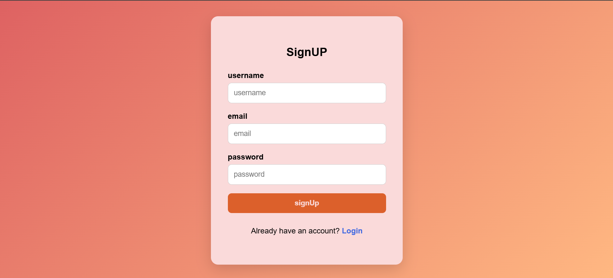
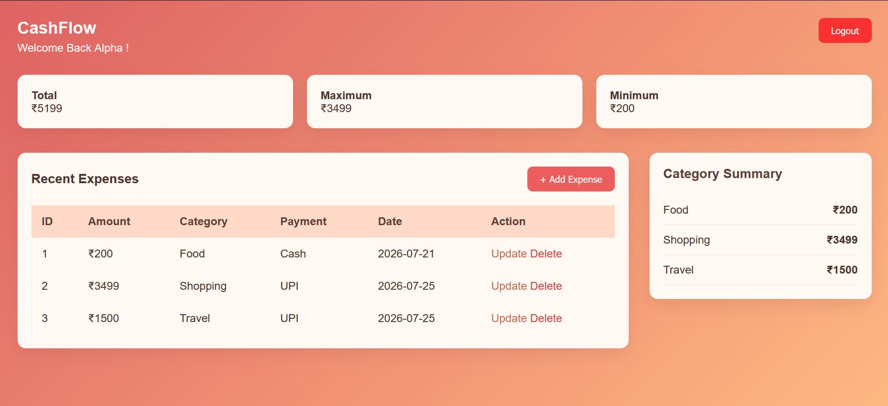
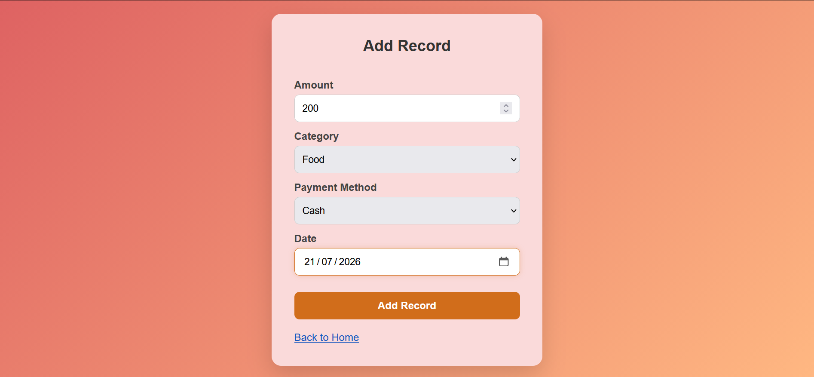
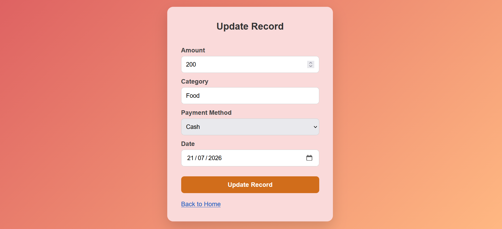

# 💰 Expense Tracker

A full-stack Expense Tracker web application built with **Flask, Python, SQLite, HTML, CSS, and JavaScript**. The application enables users to securely manage their daily expenses with authentication, CRUD operations, and a clean dashboard displaying expense summaries.

---

## 🚀 Live Demo

🔗 https://expensetracker-vnlk.onrender.com/

---

## 📸 Screenshots

### Login Page



### Dashboard



### Add Expense



### Update Expense



## ✨ Features

- 🔐 User Signup & Login
- 🔒 Secure password hashing using bcrypt
- 👤 Individual user accounts
- ➕ Add expenses
- ✏️ Update expenses
- ❌ Delete expenses
- 📊 Dashboard showing:
  - Total Expenses
  - Maximum Expense
  - Minimum Expense
- 📋 View all expenses in a responsive table
- 🎨 Modern and responsive UI
- 🔓 Logout functionality

---

## 🛠️ Tech Stack

### Backend
- Python
- Flask
- SQLite
- bcrypt
- Gunicorn (for deployment)

### Frontend
- HTML5
- CSS3
- JavaScript

---

## 📁 Project Structure

```text
ExpenseTracker/
│
├── app.py                  # Flask application factory
├── run.py                  # Entry point to run the application
├── auth.py                 # Authentication routes
├── expense.py              # Expense-related routes
├── database.py             # Database connection and queries
├── expenseTracker.db       # SQLite database
├── requirements.txt
├── README.md
│
├── static/
│   ├── auth.css
│   ├── home2.css
│   ├── action.css
│   └── index.js
│
├── templates/
│   ├── index.html
│   ├── home.html
│   ├── add.html
│   └── edit.html
│
└── screenshots/
    ├── login.png
    ├── dashboard.png
    └── add-expense.png
```

---

## ⚙️ Installation

### 1. Clone the repository

```bash
git clone https://github.com/Deepak08-AA/ExpenseTracker.git
```

### 2. Move into the project directory

```bash
cd ExpenseTracker
```

### 3. Create a virtual environment

**Windows**

```bash
python -m venv venv
venv\Scripts\activate
```

**Linux / macOS**

```bash
python3 -m venv venv
source venv/bin/activate
```

### 4. Install dependencies

```bash
pip install -r requirements.txt
```

### 5. Run the application

```bash
python run.py
```

Visit:

```
http://127.0.0.1:5000
```

---

## 📦 Requirements

Install all dependencies with:

```bash
pip install -r requirements.txt
```

---

## 🔐 Authentication

User passwords are securely hashed using **bcrypt** before being stored in the database, ensuring that plaintext passwords are never saved.

---

## 🗄️ Database Schema

### Users

| Column | Type |
|---------|------|
| id | INTEGER |
| username | TEXT |
| email | TEXT |
| password | TEXT |

### Expenses

| Column | Type |
|---------|------|
| id | INTEGER |
| user_id | INTEGER |
| amount | REAL |
| category | TEXT |
| payment_method | TEXT |
| date | TEXT |

---

## 📸 Screenshots

> Add screenshots inside the `screenshots/` folder.

- Login Page
- Dashboard
- Add Expense
- Update Expense

---

## 🚀 Future Improvements

- 📈 Expense charts and analytics
- 🔍 Search expenses
- 📅 Filter by date
- 📤 Export data to CSV/PDF
- 🌙 Dark mode
- 💵 Monthly budget tracking
- 📱 Better mobile responsiveness

---

## 👨‍💻 Author

**Deepak Tomar**

- GitHub: https://github.com/Deepak08-AA
- LinkedIn: www.linkedin.com/in/deepak-tomar08

---

## ⭐ Support

If you found this project helpful, please consider giving it a **⭐** on GitHub.
